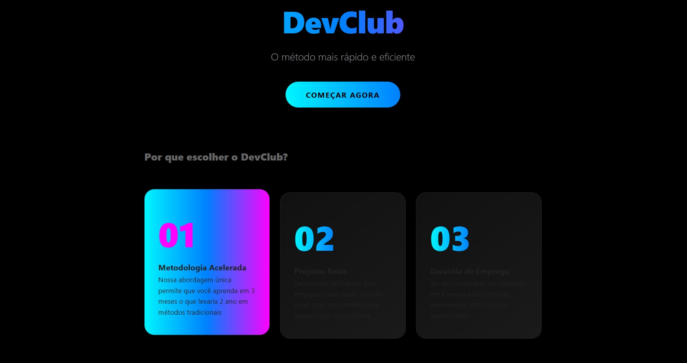
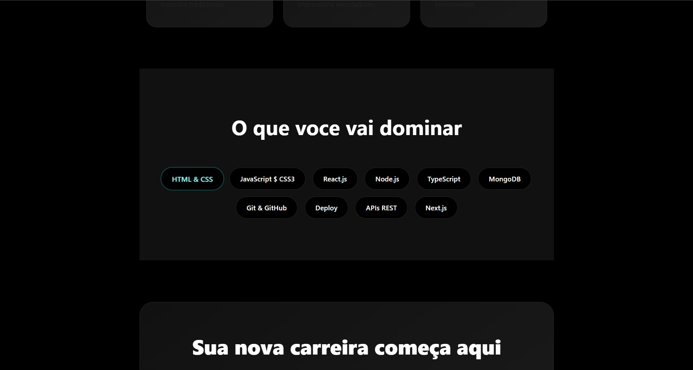
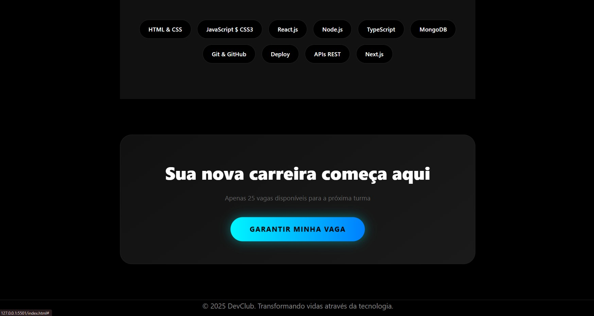

# 💻 Landing Page - DevClub

Este projeto é uma **Landing Page profissional** desenvolvida como prática de HTML e CSS, com foco em estrutura, semântica e design moderno.

---

## 📸 Preview do Projeto

<p align="center">
  <br>
  <br>
  
</p>

---

## 🚀 Tecnologias Utilizadas

- HTML5
- CSS3
- Flexbox
- Design responsivo

---

## 📁 Como usar

1. Clone o repositório:
   ```bash
   git clone https://github.com/ScatmanVit/Landing_Page_CSS.git
